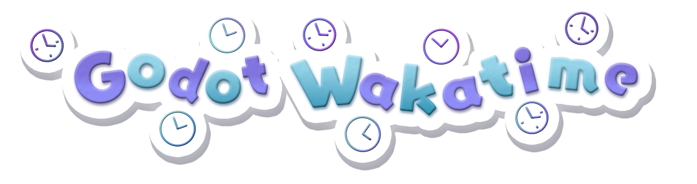

<!-- SHIELDS -->
[![Contributors][contributors-shield]][contributors-url]
[![Forks][forks-shield]][forks-url]
[![Stargazers][stars-shield]][stars-url]
[![Issues][issues-shield]][issues-url]
[![MIT License][license-shield]][license-url]

<!-- HEADER -->
 

    
    <h3 align="center"> Godot Super Wakatime </h3>
    

        Tool to measure time spent in the Godot Game Engine! 
         
        Officially approved to use in events created by Hack Club
         
         
        <a href="https://store.godotengine.org/asset/bartoszb/godot-super-wakatime/">Get from Asset Store (Godot 4.7+)</a>
        .
        <a href="https://godotengine.org/asset-library/asset/3484">Get from Asset Lib</a>
        ·
        <a href="https://youtu.be/rqAc-YdVXyM">View Demo</a>
        ·
        <a href="https://github.com/BudzioT/Godot_Super-Wakatime/issues/new">Report Bug / Request Feature</a>
    

## About 

Please check [the Hackatime
documentation](https://hackatime.hackclub.com/docs/editors/godot) for up to
date documentation on how to install Godot Super Wakatime!

Although built for Hackatime, Godot Super Wakatime will work with any valid
Wakatime server.

## License

Distributed under the MIT License. See `LICENSE` for more information.

